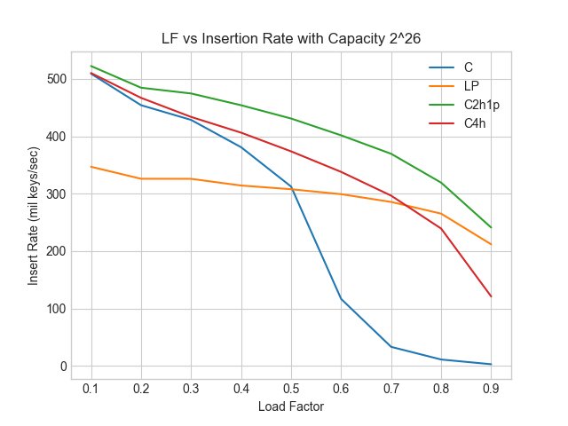

# About

This project is done as a final project for Comp 480.

The project is based on [Nosferalatu's simple GPU linear probing hash table](https://github.com/nosferalatu/SimpleGPUHashTable) 
and [CUDPP's cuckoo hash table](https://github.com/cudpp/cudpp). The aim was to compare the two hashing schemes on the 
GPU, and also explore other hashing schemes. 

[Read our report here](http://nosferalatu.com/SimpleGPUHashTable.html) for more information about the project/experiment.

# Prerequisites

* CMake
* CUDA

This has been tested on Windows with Visual Studio Community 2019 on a machine with an NVIDIA GTX 1060.
An easy way to get CMake is to open a Visual Studio command prompt (in Windows, run "x64 Native Tools Command Prompt for
VS 2019"; that will put CMake in your path).

This should work on other CUDA-supported platforms, but I have not tested this.

# Generating Build Files

Run the following commands to generate .sln and .vcxproj's that can be opened in Visual Studio:

```
cd ConcurrentHashTables
md build
cd build
cmake ..
```

You can now open `SimpleConcurrentGPUHashTable.sln` in Visual Studio.

If CMake fails to find CUDA above, then run a CMake generator for 64 bit builds:
```
cmake -G "Visual Studio 16 2019 Win64" ..
```

# Building

You can build within Visual Studio, or from the command line with:

```
cmake --build . --config Release
```

# Testing & Plotting

Then running the text.exe built from the prior command, it will run the tests on the 4 kinds of hash tables each with capacities 2^10, 2^14, 2^18, 2^22, 
2^26, and Load Factor 0.1, ..., 0.9.

The generated txt log files can be put into the plotting/data directory, and then the ht_data_plot.py will generate the 
plots.